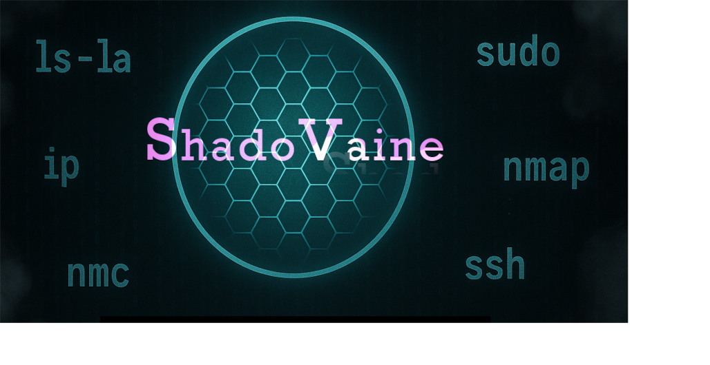

<p align="center">
  
</p>

# 🦂 ShadoVaine Here, Welcome!!!!

## Cybersecurity Apprentice | Linux Wrangler | CLI Addict | Home Lab Builder | 

I’m a former healthcare worker, Army veteran who is now diving deep into the world of Linux, cybersecurity, and network defense. My mission?  
**To become the quiet sentinel on the edge of the wire.**

---
# 🎞️ FEATURED RELEASES!!!! 🎞️
---
<p align="center">
  </p>
  
<p align="center">
  </p>


- **lcl** – A lightweight command-line interface library of Linux commands and drills, giving sysadmins and students a Terminal UI (TUI) to learn & reference syntax on the fly.

# Installation

```bash
pipx install linux-command-library
```
## Usage
```
lcl
```
# Requirements
- Python 3.10+
- Linux, macOS, or WSL

---

### 📦 PyPI & Repository Links
<p align="center">
  <a href="https://pypi.org/project/linux-command-library/">
    
  </a>
  <a href="https://pepy.tech/project/linux-command-library">
    
  </a>
  <a href="https://github.com/Shadovaine/linux-command-library/stargazers">
    
  </a>
  <a href="https://github.com/Shadovaine/linux-command-library/issues">
    
  </a>
  <a href="https://github.com/Shadovaine/linux-command-library/blob/main/LICENSE">
    
  </a>
</p>

---


---
<p align="center">
  </p>
---

# 📚 The LCLibrary (Static Edition) 📚

The **LCLibrary** is a categorized, static Markdown library containing syntax, explanations, and real-world examples for 180+ Linux commands.  
It’s designed to be:
- 📚 **Offline-ready:** clone it, keep it local, learn anywhere.  
- 🔍 **Searchable by category:** organized by system function (networking, permissions, processes, etc.).  
- 🧠 **Educational:** built for CompTIA Linux+, SysAdmin training, and cybersecurity fundamentals.  

## 🚀 How to Use It 🚀

## Option 1 — Browse online (no install needed):  
Visit: [LCLibrary on GitHub](https://github.com/ShadoVaine/LCLibrary)

## Option 2 — Use offline:  
```bash
# Clone the library
git clone https://github.com/ShadoVaine/LCLibrary.git
cd LCLibrary
```

```
<p align="center">
  </p>
```
# DocumentationLabs

**The DocumentationLabs Project grew out of a need to learn Documentation standards and provide scenarios for practice.**

Lab Scenarios cons


---
### 🗺️ Roadmap 🗺️
- [ ] Developing a Desktop and Mobile version of the LCLibrary containing drills, fill-in-the-blank questions, quizes, and other small games to help learn Linux commands.

---

---
### ♏ What I'm About ♏
> *"The person you’re afraid of looking dumb in front of… probably respects you for trying in the first place."*  
> – **Shadow Wisdom**

I’m learning in public — not because I know it all, but because I’m committed to knowing more tomorrow than I did today.

---

### 🛠️ Tech Stack I'm Focused On 🛠️

[](https://ubuntu.com/)
[](https://www.kali.org/)
[](https://lubuntu.me/)

[](https://www.python.org/)
[](https://www.gnu.org/software/bash/)
[](https://learn.microsoft.com/powershell/)
[](https://github.com/)


---

### 🌐 Connect with Me 🌐
- [Follow me on X (Twitter)](https://x.com/ShadoVaine)
- Email: shado.sec@proton.me

---

> 🧙‍♂️ _“In order to know God, you must know the Devil.”_ – **🦂 ShadoVaine**


